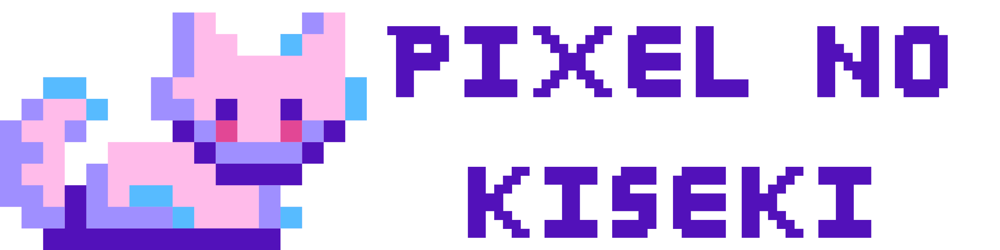

# Pixel no Kiseki (ピクセルノキセキ)



[](https://opensource.org/licenses/MIT)
[](https://github.com/yigit-guven/Pixel-no-Kiseki)
[](https://github.com/yigit-guven/Pixel-no-Kiseki/pulls)

**Pixel no Kiseki** is a sleek, glassmorphic pixel art editor designed for precision and a "Zen" creative workflow. Optimized for 8-bit icons, sprites, and game assets, it combines professional-grade tools with a focused, distraction-free environment.

---

## ✨ Key Features

- **Zen Contextual Controls**: Settings panels (Color/Brush) only appear when relevant and can be toggled by re-clicking the active tool, maximizing your workspace.
- **Glassmorphic Aesthetic**: A premium, modern interface with real-time blur and reactive dark/light themes.
- **Advanced Color Engine**: Full support for **RGBC Alpha/Transparency**, custom palette swatches, and manual Hex input.
- **Unified Portability**: Zero-dependency architecture. Runs perfectly via local `file://` protocol or any web server.
- **Precision Viewport**: Real-time rendering engine with pixel-accurate snapping and high-performance zoom/pan.
- **Physical Export**: Non-destructive canvas resizing with strict buffer cropping—exported PNGs match your dimensions exactly.

## 🛠️ Toolset

- **Pencil [P]**: DDA-based line drawing with multi-pixel brush support (1-16px).
- **Eraser [E]**: Context-aware erasure with size control.
- **Bucket Fill [B]**: High-speed, recursion-safe flood fill.
- **Eyedropper [I]**: Precision color sampling.
- **Hand [H]**: Seamless viewport panning.
- **Center [C]**: Instant view stabilization.

## 🚀 Getting Started

### Local Use
1. Clone the repository:
   ```bash
   git clone https://github.com/yigit-guven/Pixel-no-Kiseki.git
   ```
2. Open `index.html` in any modern browser.

### Shortcuts
| Key | Action |
| :--- | :--- |
| `P` | Pencil Tool |
| `E` | Eraser Tool |
| `B` | Bucket Fill |
| `I` | Eyedropper |
| `H` | Hand (Pan) |
| `C` | Center View |
| `Ctrl+Z` | Undo |
| `Ctrl+Y` | Redo |

## 🏗️ Architecture

The editor is powered by a **Modular Singleton Orchestrator** implemented in `app.js`:
- **State.js**: Reactive Pub/Sub core managing application synchronization.
- **Viewport.js**: Lifecycle-aware rendering pipeline.
- **Tools.js**: Mathematical core for DDA lines and bucket fill logic.
- **FileManager.js**: Strict-clipped PNG processing.

## 📄 License

Distributed under the MIT License. See `LICENSE` for more information.

---
*Created with ❤️ by [Yigit Guven](https://github.com/yigit-guven)*

